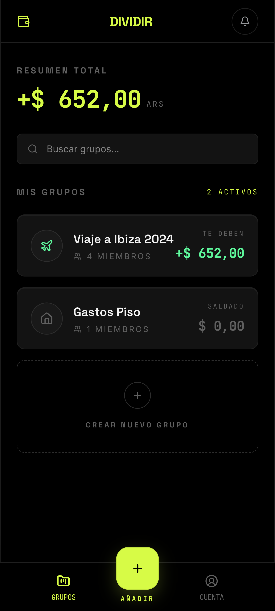

# Dividir

<p align="center">
  
</p>

<p align="center">
  Mobile-first PWA for splitting group expenses, tracking balances, and settling up in Spanish.
</p>

<p align="center">
  Built with React, Vite, TanStack Router, Convex, Convex Auth, Dexie, and vite-plugin-pwa.
</p>

## Preview

<p align="center">
  
</p>

## What It Does

Dividir is a Splitwise-style app focused on small groups like trips, dinners, and shared plans. It is designed as a mobile-first progressive web app with offline-friendly behavior, Spanish-first copy, and a fast local dev flow.

Current app scope includes:

- Email magic link, Google, and local dev login flows through Convex Auth
- Group list, group detail, add expense, settle up, and group settings screens
- Balance tracking with exact minor-unit money math
- Offline caching and queued mutations with Dexie
- PWA install support and service worker updates
- Demo data visible after local dev login, including groups like `Viaje a Ibiza 2024`

## Tech Stack

- React 19
- Vite
- TanStack Router
- Convex
- Convex Auth
- Tailwind CSS v4
- Dexie
- vite-plugin-pwa

## Getting Started

### 1. Install dependencies

```bash
npm install
```

### 2. Create local environment files

Copy the frontend env file:

```bash
cp .env.example .env.local
```

Copy the Convex deployment env file:

```bash
cp .env.convex.example .env.convex
```

### 3. Fill in the required environment variables

Frontend app env in `.env.local`:

```bash
VITE_CONVEX_URL=
CONVEX_DEPLOYMENT=
VITE_CONVEX_SITE_URL=
VITE_DEV_LOGIN_ENABLED=true
```

Convex deployment env in `.env.convex`:

```bash
AUTH_SECRET=
SITE_URL=
JWT_PRIVATE_KEY=
JWKS=
AUTH_GOOGLE_ID=
AUTH_GOOGLE_SECRET=
AUTH_RESEND_KEY=
PUSH_VAPID_PUBLIC_KEY=
PUSH_VAPID_PRIVATE_KEY=
PUSH_VAPID_SUBJECT=
```

`VITE_DEV_LOGIN_ENABLED=true` enables the one-click local login button labeled `Entrar como LLM Agent`.

### 4. Start Convex

Run the backend in one terminal:

```bash
npx convex dev
```

If you change backend auth code or Convex functions, keep this process running so generated files and local backend state stay in sync.

### 5. Start the frontend

Run the app in another terminal:

```bash
npm run dev
```

Open the local URL printed by Vite, usually `http://localhost:5175/`.

### 6. Use the local dev login

On the login screen:

1. Click `Entrar como LLM Agent`
2. Confirm the app redirects to `/groups`
3. Confirm the dashboard loads demo groups such as `Viaje a Ibiza 2024`

## Running Without Convex

If `.env.local` is missing or `VITE_CONVEX_URL` is not configured, the app can still boot in mock mode so you can inspect the shell and styling. The full authenticated flow, live data, and synced mutations require Convex.

## Available Scripts

```bash
npm run dev
npm run build
npm run lint
npm run typecheck
npm run preview
```
